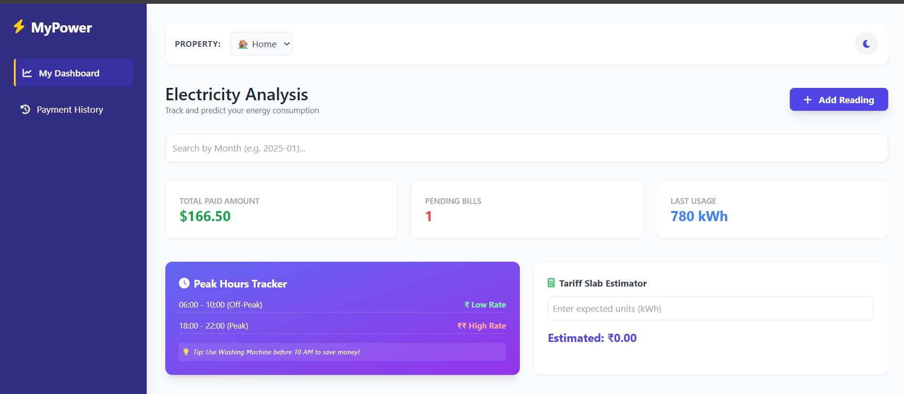
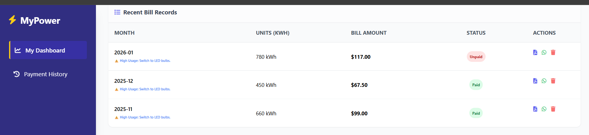

# 📘 Database Management System – Electricity Management

A **Database Management System (DBMS) mini project** developed to demonstrate the practical implementation of database concepts using a **client–server architecture**.  
The project integrates a **Flask backend**, **SQLite database**, and a **web-based frontend**.

---

## 📌 Project Overview

This application manages electricity-related data and performs basic database operations.  
It is designed to help students understand **how databases interact with applications** in real-world systems.

---

## 📁 Project Structure

```
databse managemant/
│
├── backend/
│   ├── app.py              # Flask backend server
│   ├── electricity.db      # SQLite database
│
├── frontend/
│   ├── index.html          # User interface
│   ├── script.js           # Frontend logic
│
├── images/
│   ├── home_page.png
│   ├── add-record.png
│   ├── view-records.png
│
└── README.md               # Project documentation
```

---

## 🛠 Technologies Used

- Python  
- Flask  
- SQLite  
- HTML  
- JavaScript  

---

## 🎯 Objectives

- Understand Database Management System fundamentals  
- Implement CRUD operations  
- Learn frontend–backend–database integration  
- Apply DBMS concepts in a practical project  

---

## ⚙️ System Requirements

- Python 3.x  
- pip (Python package manager)  
- Any modern web browser  

---

## ▶️ How to Run the Project

### Step 1: Install Required Package
```bash
pip install flask
```

### Step 2: Start Backend Server
```bash
cd backend
python app.py
```

### Step 3: Launch Frontend
- Open `frontend/index.html` in a web browser  
OR  
- Use Live Server in VS Code  

---

## 🗄 Database Details

- Database Name: electricity.db  
- Database Type: SQLite  
- Purpose: Store and manage electricity-related records  

---

## ✨ Key Features

- Simple and user-friendly interface  
- Backend API using Flask  
- Persistent data storage using SQLite  
- Suitable for DBMS Mini Project  

---

## 💻 Sample Code Snippet

### 🔹 Backend Code (Flask + SQLite)

```python
from flask import Flask, jsonify
import sqlite3

app = Flask(__name__)

def get_db_connection():
    conn = sqlite3.connect('electricity.db')
    conn.row_factory = sqlite3.Row
    return conn

@app.route('/records')
def get_records():
    conn = get_db_connection()
    records = conn.execute('SELECT * FROM electricity').fetchall()
    conn.close()
    return jsonify([dict(row) for row in records])

if __name__ == "__main__":
    app.run(debug=True)
```

---

### 🔹 Frontend Code (JavaScript – Fetch API)

```javascript
fetch("http://127.0.0.1:5000/records")
  .then(response => response.json())
  .then(data => {
      console.log("Electricity Records:", data);
  })
  .catch(error => {
      console.error("Error fetching data:", error);
  });
```

---

## 📸 Screenshots

### 🏠 Home Page


### ➕ Add New Record


### 📋 View Records


---

## 📚 Learning Outcomes

- Practical understanding of DBMS concepts  
- Experience with client–server architecture  
- Working knowledge of Flask and SQLite  
- Hands-on CRUD operations  

---

## 🚀 Future Enhancements

- User authentication  
- Improved UI design  
- Input validation  
- Online deployment  

---

## 👩‍💻 Author

Vaishnavi Labhasetwar  

---

## 📄 License

This project is intended for educational purposes only.
